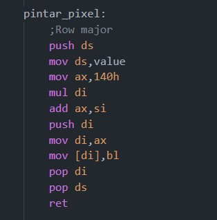

Manual técnico
===============

#### Universidad de San Carlos de Guatemala
#### Facultad de Ingeniería
#### Arquitectura de computadoras y Ensambladores 1
#### Sección A
#### Segundo Semestre 2023

## Microsoft Macro Assembler

La práctica fue realizada en el lenguaje Microsoft macro assembler en su version 6.11 y usando el emulador Dosbox el cual simula el entorno del sistema MS-DOS.

Tambien se utilizo el modo de video 13h de la interrupcion 10.

## 1 Estructura

La practica se realizo en su mayor parte usando interrupciones. Estas detienen la ejecución del programa hasta que se termine la interaccion con el sistema operativo. 

Para visualizar los graficos se uso la direccion de memoria 0Ah en el segmento de datos. Esto permite colocar o dibujar cualquier pixel que se desee.

## 2 Saltos
Para controlar el flujo dl programa se utilizaron saltos y saltos condicionales. Asi mismo se hizo el uso de la stack para almacenar tanto el valor de retorno como valores temporales que necesito posteriormente y que no deseo que se pierdan.

## 3 Juego
Para la posicion de cada carro se utilizó un arreglo tanto para guardar las posiciones x,y.

