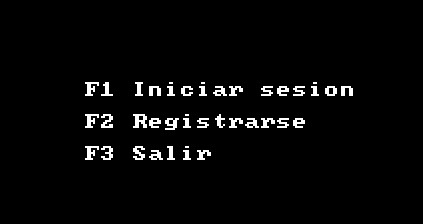
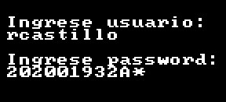
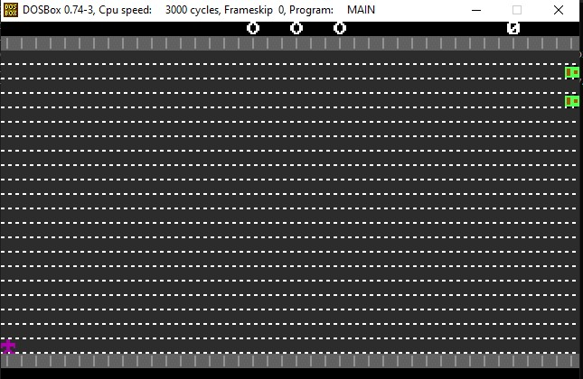

Manual de usuario
==========
#### Universidad de San Carlos de Guatemala
#### Facultad de Ingeniería
#### Arquitectura de computadoras y Ensambladores 1
#### Sección A
#### Segundo Semestre 2023

- [Introduccion](#1.0)
- [Inicio del programa](#2.0)
- [Iniciar sesion](#3.0)
- [Iniciar partida](#4.0)
- [Modo juego](#5.0)

## 1.0 Introduccion 
La aplicacion permite ejecutar un juego el cual consiste en pasar al otro lado de la banqueta.

## 2.0 Inicio del programa 
Al principio de la ejecución se muestra el menu para iniciar sesion, registrarse y salir.

## 3.0 Iniciare sesion
Se le pide ingresar el nombre de usuario y contraseña para poder ingresar. Seguidamente se le pedirá ingresar la contraseña.

## 4.0 Iniciar partida
Al presionar la tecla F1 se iniciará una nueva partida para jugar.

## 5.0 Modo juego
Si se logra pasar al otro lado de la carretera entonces se suman puntos. Asi mismo dependiendo de la cantidad de vidas que se tengan se irán sumando puntos.

Si pierde todas las vidas entonces se regresa al menu principal

